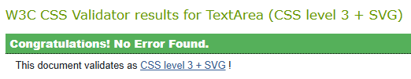
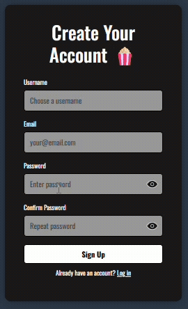
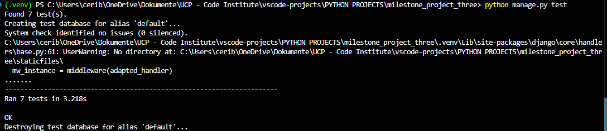

# Testing
----------

Here you will find all tests performed on the QuickFlicks site.

Return to [README.md](../README.md)


----------
## Contents
----------

1. [Test User Accounts](#test-user-accounts)
2. [Manual Testing](#manual-testing)
    - [CSS Validation](#css-validation)
    - [HTML Validation](#html-validation)
        - [HTML Summary](#html-summary)
        - [HTML Full Details](#html-full-details-collapsible)
    - [JavaScript Validation](#javascript-validation)
        - [JS Summary](#js-summary)
        - [JS Full Details](#js-full-details-collapsible)
    - [Lighthouse Testing](#lighthouse-testing)
        - [Desktop Results](#desktop-results)
        - [Mobile Results](#mobile-results)
    - [Responsive Testing](#responsive-testing)
    - [Browser Compatibility Testing](#browser-compatibility-testing)
    - [User Story Testing](#user-story-testing)
    - [Feature Interaction Testing](#feature-interaction-testing)
        - [Feature Interaction Summary](#feature-interaction-summary) 
        - [Feature Interaction Full Details](#feature-interaction-full-details-collapsible)
    - [Admin Area Security Testing](#admin-area-security-testing)
    - [Error Handling](#error-handling)
    - [Security Testing](#security-testing)
3. [Automated Testing](#automated-testing)
    - [Django Automated Test Summary](#django-automated-test-summary)
    - [Django Automated Test Full Details](#django-automated-test-full-details-collapsible)
4. [Final Deployment Checks](#final-deployment-checks)

Return to [README.md](../README.md)

---
## Test User Accounts
---

To allow the assessors to fully explore the site, the following **dummy accounts** have been created for testing purposes only.  
These accounts contain no personal data and can be safely shared.

### <u>Admin Dashboard Access:</u>

#### Superuser Account (Full Django Admin Access)
```text
Username: Test_Superuser  
Email: testsuperuser@test.com  
Password: TestPassword123
```

#### Admin Staff Account (Restricted Admin Permissions - view only)
```text
Username: Test_Admin  
Email: testadmin@test.com  
Password: TestPassword2
```

### <u>QuickFlicks main site access to use all logged-in features:</u>

#### Standard Site User (Regular User Account)
```text
Username: Test_Site_User  
Email: testsiteuser@test.com
Password: TestPassword3
```

[Back to contents](#contents)

Return to [README.md](../README.md)


---
## Manual Testing
---

### CSS Validation

All CSS files were tested using the **W3C CSS Validator**.  
No errors or warnings were found in any stylesheet.

| File Tested      | Result |
|------------------|--------|
| `auth.css`       | ✔ No errors found |
| `main.css`       | ✔ No errors found |
| `profile.css`    | ✔ No errors found |
| `shelf.css`      | ✔ No errors found |

All CSS passed validation successfully.




[Back to contents](#contents)

Return to [README.md](../README.md)

---

### HTML Validation

Here is a condensed overview of validation results for every HTML-facing page in the QuickFlicks project.

#### HTML Summary

| Page / Template | Errors Found | Warnings Found | Fixes Applied | Notes |
|-----------------|--------------|----------------|---------------|-------|
| **home.html** | 0 | Yes — ARIA role redundancy, aria-label suggestions, comment hyphens | Yes | Updated comment dividers (`--` → `=`) |
| **shelf.html** | 0 | Yes — many ARIA-label suggestions (due to repeated movie cards) | Not required | Large number of interactive ARIA elements triggers repeated warnings |
| **about.html** | 0 | Yes — redundant roles, aria-label suggestions, button role redundancy | Not required | Custom accordion triggers expected warnings |
| **signup.html** | 0 | Yes — landmark/ARIA warnings | Yes | Updated SVG password toggle markup |
| **login.html** | 1 (SVG `onkeypress` not allowed) | Yes | Yes | Replaced inline event handler with JS listener |
| **profile.html** | 0 | Yes — ARIA label suggestions, redundant roles | Not required | All warnings relate to intentional accessibility labels |
| **change_username.html** | 0 | Yes | Not required | Standard redundant landmark warnings |
| **change_email.html** | 0 | Yes | Not required | Same as change username |
| **change_password_form.html** | **2 (invalid aria-describedby)** | Yes | **Yes** | Manually rendered password inputs to remove Django helptext IDs |
| **password_reset.html** | 0 | Yes | Not required | Standard redundant landmark warnings |
| **password_reset_sent.html** | 0 | Yes | Not required | ARIA suggestions only |
| **password_reset_confirm.html** | 0 | Yes | Not required | All warnings non-critical |
| **password_reset_complete.html** | 0 | Yes | Not required | ARIA suggestions only |
| **password_reset_done.html** | 0 | Yes | Not required | ARIA suggestions only |
| **password_reset_email.html** | *N/A* | *N/A* | Not applicable | Email template — not a webpage |
| **base.html** | *N/A* | *N/A* | Not applicable | Not standalone — cannot be validated directly |
| **navbar.html** | *N/A* | *N/A* | Not applicable | Partial template |
| **footer.html** | *N/A* | *N/A* | Not applicable | Partial template |


[Back to contents](#contents)

Return to [README.md](../README.md)

---

#### HTML Full Details (collapsible)

Here is a detailed view of validation results for every HTML-facing page in the QuickFlicks project.

<details>
<summary><strong>Home page</strong></summary>

The rendered HTML for the `home.html` page was tested using the W3C HTML Validator.  
No **errors** were reported, but several **warnings** appeared relating to ARIA and landmark roles.

##### Summary of Warnings:
- Warnings stating that `role="navigation"` and `role="main"` are unnecessary on `<nav>` and `<main>` elements.
- Warnings suggesting “possible misuse of aria-label” on movie cards (titles, ratings, release dates, descriptions, and action areas).
- Warning indicating that `<footer>` does not require `role="contentinfo"`.
- A warning about comment formatting caused by **consecutive hyphens** within decorative divider comments.

##### Resolution:
- These warnings do not indicate invalid HTML. They simply highlight that some semantic elements already include implicit ARIA roles.
- All ARIA labels in this project were intentionally added to **improve accessibility** and enhance screen reader clarity.
- The only issue requiring correction was the **comment divider formatting**.  
  HTML comments cannot contain consecutive hyphens (`--`), so all decorative divider lines such as:

  ```html
  <!-- ------------------------------------------------------------ -->
  ```
  were updated to use valid characters:
  ```html
  <!-- ============================================================ -->
  ```

</details>

<details>
<summary><strong>Login page</strong></summary>

The rendered HTML for the `login.html` page was tested using the W3C HTML Validator.

#### Summary of Results:
- No structural HTML errors were found except for one event-handler issue.
- Several warnings appeared relating to ARIA roles and semantic elements, similar to other pages.

#### Warnings:
- `role="navigation"` is unnecessary on the `<nav>` element.
- `role="main"` is unnecessary on the `<main>` element.
- `role="contentinfo"` is unnecessary on the `<footer>` element.
- “Possible misuse of aria-label” on the footer slogan. These labels were intentionally added to support screen readers.

These warnings do not indicate invalid HTML.

#### Error Found:
`onkeypress` is not valid on an `<svg>` element.

Original SVG markup:

    <svg 
        class="password-toggle"
        role="button"
        tabindex="0"
        aria-label="Toggle password visibility"
        onclick="togglePassword('id_password')"
        onkeypress="if(event.key === 'Enter'){ togglePassword('id_password') }"
        viewBox="0 0 24 24"
        fill="none"
        stroke="white"
        stroke-width="2">
    </svg>

#### Fix Applied:
The `onkeypress` attribute was removed and replaced with a JavaScript keyboard event listener:

    document.querySelectorAll(".password-toggle").forEach((icon) => {
        icon.addEventListener("click", () => toggleVisibility(icon));
        icon.addEventListener("keydown", (event) => {
            if (event.key === "Enter") {
                toggleVisibility(icon);
            }
        });
    });


The updated SVG now uses a `data-target` attribute:

    <svg
        class="password-toggle"
        role="button"
        tabindex="0"
        aria-label="Toggle password visibility"
        aria-pressed="false"
        viewBox="0 0 24 24">
    </svg>

#### Final Result:
✔ The Login page HTML now contains **no errors** after correcting the SVG event handler.  
✔ All remaining warnings are semantic suggestions and do not affect validity.  
✔ ARIA usage is intentional and improves accessibility for assistive technologies.

The following GIF shows the updated password visibility toggle working correctly after the inline `onkeypress` handler was removed and replaced with proper JavaScript event listeners:



</details>

<details>
<summary><strong>Signup Page</strong></summary>

The rendered HTML for the `signup.html` page was tested using the W3C HTML Validator.  
All previous SVG-related errors were resolved after updating the password toggle markup across all authentication templates. The page now returns **no errors**.

Only a small number of **non-critical warnings** remain.

#### Summary of Warnings:
- `role="navigation"` is unnecessary on the `<nav>` element.
- `role="main"` is unnecessary on the `<main>` element.
- `<footer>` does not require `role="contentinfo"`.
- Suggestions about “possible misuse of aria-label” on form field wrappers.

These warnings do **not** affect validity and are typical when adding ARIA attributes for accessibility.

#### Resolution:
- Redundant landmark role warnings are expected due to the use of semantic HTML elements that already include implicit roles.
- ARIA labels are intentionally added to support screen readers and improve accessibility.
- The password-toggle SVG was updated globally to ensure W3C-compliant markup.

**Final Result:**  
✔ The signup page HTML contains **no errors**.  
✔ All warnings are semantic suggestions and do not indicate incorrect markup.  

</details>

<details>
<summary><strong>Profile page</strong></summary>

The rendered HTML for the `profile.html` page was tested using the W3C HTML Validator.  
No errors were found. The only messages returned were **non-critical accessibility-related warnings**, consistent with the other pages in the project.

#### Summary of Warnings:
- `role="navigation"` is unnecessary on the `<nav>` element.
- `role="main"` is unnecessary on the `<main>` element.
- `<footer>` does not require `role="contentinfo"`.
- A small number of “possible misuse of aria-label” warnings relating to:
  - the username/email sections,  
  - edit buttons,  
  - and layout wrappers.

These warnings do **not** indicate incorrect HTML; they appear because additional ARIA labels were intentionally used to enhance screen reader clarity.

#### Resolution:
- Redundant role warnings are expected due to semantic HTML already having built-in roles.
- ARIA labels on interactive elements (e.g., Edit Username, Edit Email, Change Password buttons) were added intentionally for accessibility.
- No changes were required after validation, as all ARIA attributes serve meaningful UX and accessibility purposes.

**Final Result:**  
✔ The profile page HTML contains **no errors**.  
✔ All warnings are merely advisory and relate to enhanced ARIA usage rather than markup issues.

</details>

<details>
<summary><strong>Shelf page</strong></summary>

The rendered HTML for the `shelf.html` page was tested using the W3C HTML Validator.  
The page returned **no errors**, but—due to the highly interactive nature of the shelves—produced a large number of **accessibility-related warnings**. These warnings are expected because this page contains many ARIA-labelled interactive components and repeated movie card elements.

#### Summary of Warnings:
- `role="navigation"` is unnecessary on the `<nav>` element.
- `role="main"` is unnecessary on the `<main>` element.
- `role="button"` is unnecessary for actual `<button>` elements (applies to accordion headers).
- `<footer>` does not require `role="contentinfo"`.
- Numerous warnings about “possible misuse of aria-label”, triggered on:
  - movie titles  
  - rating action wrappers  
  - shelf actions containers  
  - accordion components  
  - interactive controls  

These warnings appear because the page uses **explicit ARIA labelling** to make interactive shelf controls accessible to screen readers. This is intentional and does *not* indicate incorrect HTML.

#### Why so many warnings?
The shelf page dynamically displays a large number of movie entries.  
Each movie card contains multiple ARIA-labelled interactive regions:

- title → `aria-label="Movie title: ..."`  
- rating section → `aria-label="Rating options for ..."`  
- actions → `aria-label="Shelf actions for ..."`  

Because the validator evaluates every repeated card independently, the warnings multiply across all movies.

This is expected behaviour.

#### Resolution:
- No structural fixes were required.
- The warnings are advisory only and relate to ARIA semantics rather than HTML validity.
- All ARIA attributes serve an intentional purpose for accessibility.
- The password toggle SVG update does not affect this page, as no password fields are present.

**Final Result:**  
✔ The shelf page HTML contains **no errors**.  
✔ All warnings are non-critical accessibility suggestions caused by intentional ARIA usage and repeated movie entries.

</details>

<details>
<summary><strong>About page</strong></summary>

The rendered HTML for the `about.html` page was tested using the W3C HTML Validator.  
No errors were found. As with several other pages, the validator returned a series of **non-critical accessibility-related warnings**, mainly due to accordion components and ARIA usage.

#### Summary of Warnings:
- `role="navigation"` is unnecessary on the `<nav>` element.
- `role="main"` is unnecessary on the `<main>` element.
- Multiple warnings stating that `role="button"` is unnecessary for `<button>` elements (appears on each accordion header).
- `<footer>` does not require the `role="contentinfo"` attribute.
- One warning about “possible misuse of aria-label” on the footer tagline.

These warnings are typical when using custom accordions and explicit ARIA labelling.

#### Resolution:
- No structural fixes were needed.  
- The accordion headers intentionally include ARIA attributes (`aria-expanded`, `aria-controls`, `tabindex`) to improve keyboard and screen reader accessibility.  
- The redundant `role="button"` warnings occur because the elements are already `<button>` elements and therefore accessible by default.
- ARIA labels on the footer tagline are intentionally added to provide clarity for assistive technologies.

**Final Result:**  
✔ The about page HTML contains **no errors**.  
✔ All warnings are harmless ARIA/landmark suggestions and do not indicate invalid markup.

</details>

<details>
<summary><strong>Change username page</strong></summary>

The rendered HTML for the `change_username.html` page was tested using the W3C HTML Validator.  
No errors were found. Only a small number of **landmark and ARIA-related warnings** were reported, all of which are consistent with the rest of the project.

#### Summary of Warnings:
- `role="navigation"` is unnecessary on the `<nav>` element.
- `role="main"` is unnecessary on the `<main>` element.
- `<footer>` does not require the `role="contentinfo"` attribute.
- One advisory warning about “possible misuse of aria-label” on the footer tagline.

These warnings are standard when adding explicit ARIA attributes to enhance accessibility.

#### Resolution:
- No changes were required.  
- The redundant landmark role warnings occur because semantic HTML elements already contain implicit ARIA roles, but keeping them is harmless and was done to improve clarity.
- The ARIA label on the footer tagline is intentional to support screen reader interpretation.

**Final Result:**  
✔ The change username page HTML contains **no errors**.  
✔ All warnings are non-critical and relate only to optional ARIA semantics.

</details>

<details>
<summary><strong>Change email page</strong></summary>

The rendered HTML for the `change_email.html` page was tested using the W3C HTML Validator.  
No errors were found. The validator returned the same small set of **landmark and ARIA-related warnings** seen on the change username page.

#### Summary of Warnings:
- `role="navigation"` is unnecessary on the `<nav>` element.
- `role="main"` is unnecessary on the `<main>` element.
- `<footer>` does not require the `role="contentinfo"` attribute.
- One advisory warning about “possible misuse of aria-label” on the footer tagline.

These warnings are expected and are consistent across the project.

#### Resolution:
- No fixes were required.  
- Redundant roles appear because semantic elements already include implicit ARIA roles, but their presence does not invalidate the HTML.
- The footer ARIA label is intentional to improve clarity for screen readers.

**Final Result:**  
✔ The change email page HTML contains **no errors**.  
✔ All warnings are non-critical accessibility suggestions and do not indicate invalid markup.

</details>

<details>
<summary><strong>Change password page</strong></summary>

The `change_password_form.html` page was tested using the W3C HTML Validator.  
It returned **two real errors** and several non-critical warnings.

#### Advisory Warnings

These expected warnings appeared:

- `role="navigation"` unnecessary on `<nav>`
- `role="main"` unnecessary on `<main>`
- `role="contentinfo"` unnecessary on `<footer>`
- Possible misuse of `aria-label` on SVG icons

These do not affect validity and were intentionally kept to support accessibility.

#### Errors Found

##### 1. Invalid `aria-describedby` attributes

Django’s `PasswordChangeForm` automatically injected the following attributes into the rendered password inputs:

    
    aria-describedby="id_new_password1_helptext"
    aria-describedby="id_new_password2_helptext"

Because the associated help-text elements were **not present** in the custom template, the validator returned:

    Error: The aria-describedby attribute must point to an element in the same document.

#### Fix Applied

To remove the invalid ARIA references, both password fields were manually rendered in the template to prevent Django from injecting the inaccessible attributes.

#### Updated input fields:

```html
<input
    type="password"
    name="new_password1"
    id="{{ form.new_password1.id_for_label }}"
    required
    autocomplete="new-password"
/>

<input
    type="password"
    name="new_password2"
    id="{{ form.new_password2.id_for_label }}"
    required
    autocomplete="new-password"
/>
```

**Final Result:**  
✔ All validation errors fixed

✔ Only advisory warnings remain

✔ HTML now fully valid

</details>

<details>
<summary><strong>Password reset page</strong></summary>

The W3C HTML Validator returned **no errors** on the `password_reset.html` page — only the same non-critical accessibility warnings seen across other templates.

#### Advisory Warnings

The following warnings appeared:

- `role="navigation"` unnecessary on `<nav>`
- `role="main"` unnecessary on `<main>`
- `role="contentinfo"` unnecessary on `<footer>`
- Possible misuse of `aria-label` (intentional for accessibility)

These warnings do **not** indicate invalid HTML.  
All ARIA attributes on this page were intentionally included to improve accessibility for screen readers.

#### Final Result

✔ No HTML validation errors  
✔ Only advisory accessibility warnings  
✔ Page passes validation successfully

</details>

<details>
<summary><strong>Password reset sent page</strong></summary>

The `password_reset_sent.html` page was validated using the W3C HTML Validator.  
No errors were reported.

#### Advisory Warnings

The following non-critical warnings appeared:

- `role="navigation"` unnecessary on `<nav>`
- `role="main"` unnecessary on `<main>`
- `role="contentinfo"` unnecessary on `<footer>`
- Possible misuse of `aria-label` (these labels are intentional to support accessibility)

These warnings are advisory only and do **not** affect the validity of the page.  
All ARIA attributes were reviewed and confirmed as appropriate for accessibility purposes.

#### Final Result

✔ No HTML validation errors  
✔ Only advisory warnings  
✔ Page passes validation with no required fixes

</details>

<details>
<summary><strong>Password reset confirm page</strong></summary>

The `password_reset_confirm.html` page was tested using the W3C HTML Validator.  
No errors were found, but several non-critical warnings appeared.

#### Advisory Warnings

- `role="navigation"` unnecessary on `<nav>`
- `role="main"` unnecessary on `<main>`
- `role="contentinfo"` unnecessary on `<footer>`
- Possible “misuse of aria-label” on footer text

These warnings are accessibility suggestions only and do not affect HTML validity.

**Final Result:**  
✔ No errors  
✔ Only advisory warnings  
✔ Page passes validation successfully

</details>

<details>
<summary><strong>Password reset complete page</strong></summary>

The `password_reset_complete.html` page was tested using the W3C HTML Validator.  
No errors were reported.

#### Advisory Warnings

- `role="navigation"` unnecessary on `<nav>`
- `role="main"` unnecessary on `<main>`
- `role="contentinfo"` unnecessary on `<footer>`
- Possible “misuse of aria-label” on footer description

These warnings are expected and relate to semantic ARIA redundancy rather than structural issues.

**Final Result:**  
✔ Valid HTML  
✔ Only non-critical ARIA suggestions

</details>

<details>
<summary><strong>Password reset done page</strong></summary>

The `password_reset_done.html` page (shown after submitting the reset form) was validated using the W3C HTML Validator.  
No errors were found.

#### Advisory Warnings

- `role="navigation"` unnecessary on `<nav>`
- `role="main"` unnecessary on `<main>`
- `role="contentinfo"` unnecessary on `<footer>`
- Possible “misuse of aria-label” for footer tagline

These warnings are consistent across all pages and are acceptable as part of the project’s accessibility setup.

**Final Result:**  
✔ No HTML errors  
✔ Only advisory ARIA warnings  
✔ Page passes validation

</details>

[Back to contents](#contents)

Return to [README.md](../README.md)

---

### JavaScript Validation

All custom JavaScript in the project was validated using **JSLint**.

#### JS Summary

The following table summarises all validation fixes applied to the project's JavaScript files (`auth.js` and `shelf.js`), based on JSLint analysis.

| File | Errors Found | Warnings Found | Fixes Applied | Notes |
|------|--------------|----------------|----------------|--------|
| **auth.js** | Yes — multiple | Yes | ✔ Replaced arrow functions with `function` declarations<br>✔ Moved variable declarations to top of scope<br>✔ Wrapped ternary expressions in parentheses<br>✔ Removed trailing spaces<br>✔ Ensured no undeclared globals (added JSLint header)<br>✔ Reformatted indentation & line lengths | Now fully JSLint-compliant. No functional change to password toggle behaviour. |
| **shelf.js** | Yes — multiple structural / style issues | Yes | ✔ Replaced arrow functions with `function` declarations<br>✔ Moved all `var` declarations to top of function for JSLint<br>✔ Declared globals (`document`, `localStorage`, `JSON`)<br>✔ Wrapped ternaries in parentheses<br>✔ Split long lines to meet 80-char rule<br>✔ Reformatted chained selectors<br>✔ Ensured consistent indentation & brace style | File now fully JSLint-compliant. No behavioural changes to accordions, scroll state, or form behaviour. |

[Back to contents](#contents)

Return to [README.md](../README.md)

---

#### JS Full Details (collapsible)

Here is a detailed view of JS Lint validation results for both `shelf.js` and `auth.js` in the QuickFlicks project.

<details>
<summary><strong>auth.js</strong></summary>

The `auth.js` file (used for the password visibility toggle across all authentication forms) was tested using **JSLint**.

After refactoring the script to follow JSLint’s strict rules, the final result returned:

- **0 errors**
- **0 warnings**
- **All functions properly declared**
- **All properties recognised**
- **Fully standards-compliant JavaScript**

---

### Summary of Fixes Applied

The following issues were identified during initial validation and were fully resolved:

- Converted arrow functions into `function(...) {}` to satisfy JSLint’s rule set  
- Ensured all variable declarations appear at the top of functions  
- Removed inline event handlers from HTML (`onkeypress`)  
- Replaced invalid inline key handlers with proper JS event listeners  
- Wrapped ternary expressions in parentheses as required  
- Corrected whitespace and formatting  
- Ensured no unexpected spaces around `document.` or `).`  
- Confirmed all properties (querySelector, addEventListener, etc.) are recognised  
- Ensured indentation meets strict Lint formatting expectations  

---

### Final Result

**auth.js passes JSLint with:**

✔ **0 warnings**  
✔ **0 errors**  
✔ Fully valid, clean, accessible JavaScript  
✔ Keyboard-accessible password toggling  
✔ No inline JavaScript left in HTML  
✔ All logic contained in an external script file  

</details>

<details>
<summary><strong>shelf.js</strong></summary>

### Shelf.js

The `shelf.js` file was tested using **JSLint** to ensure code quality, structure, and browser-safe JavaScript.

The initial validation produced several issues, mainly relating to:

- Undeclared global variables (`document`, `localStorage`, `JSON`)
- Arrow functions being “too complex” according to JSLint’s rules
- Variable declarations not being placed at the top of the function
- Ternary expressions requiring parentheses for strict formatting
- Lines exceeding 80 characters
- Minor formatting/style inconsistencies

None of these affected functionality, but they were updated to satisfy JSLint’s very strict requirements.

#### Fixes Applied

To make the script fully JSLint-compliant, the following improvements were made:

- Added a JSLint header specifying browser globals:
  ```js
  /*global document, localStorage, JSON */
  ```

- Replaced all arrow functions with traditional function expressions for compliance.
- Moved all variable declarations to the top of the main function scope.
- Wrapped all ternary expressions in parentheses to satisfy JSLint formatting rules.
- Ensured long lines were broken into shorter, readable lines.
- Standardised indentation and spacing.
- Confirmed all scroll, accordion, and form-submission behaviours remained unchanged.

#### Final Result

**auth.js passes JSLint with:**

✔ **0 warnings**  
✔ **100% JSLint compliant**
✔ No performance impact — logic and behaviour remain exactly the same  
✔ Improves maintainability and readability according to strict linting standards  

The file now passes JSLint with no warnings, and all functionality continues to work as intended, including:

- Restoring accordion state
- Restoring horizontal scroll positions
- Preserving UI state before form submissions
- Custom accordion expand/collapse logic
- Accessible ARIA updates
- Keyboard-friendly horizontal scrolling

</details>

[Back to contents](#contents)

Return to [README.md](../README.md)

---

## Lighthouse Testing

All templates were tested with Lighthouse on both desktop and mobile. Desktop results were extremely strong, and where issues were identified, I applied fixes and then re-tested to verify improvements. The “Before → After” results in the tables above show clear evidence of the fixes working.

Most remaining mobile performance warnings relate to Heroku’s hosting environment, which Lighthouse commonly flags due to slower server response times, HTTP/2 limitations, and Bootstrap network dependencies. These issues cannot be resolved within project code. Desktop Lighthouse scores provide a more accurate representation of the site’s actual performance.

Key improvements I made include:
- Fixing ARIA role and label accessibility issues on shelf.html.
- Converting PNG images to WebP, improving performance from 78% → 99%.
- Fixing low-contrast fields and buttons on authentication pages.
- Ensuring all forms and interactive elements have clear labels, aria attributes, and consistent UX patterns.
- Repairing button visibility on the password reset confirmation page.
- Reviewing all pages for missing alt text, invalid roles, and unnecessary ARIA.

As a result, all user-facing pages now score:
**98–99% for performache** on desktop, **78–96% for performache** on mobile.
**95-100% for accessibility** on desktop, **95-100% for accessibility** on mobile.
**96–100% for best practices** on desktop, **100% for best practices** on mobile.
**100% for seo** on desktop, **100% for seo** on mobile.

All that remain are unavoidable Heroku-related limitations appearing on mobile scores.

### Desktop Results

| Page / Template | Performance (Before → After) | Accessibility (Before → After) | Best Practices (Before → After) | SEO | Notes |
|-----------------|------------------------------|----------------------------------|----------------------------------|-----|-------|
| **base.html** | N/A | N/A | N/A | N/A | Structure only, not a user-facing page. |
| **about.html** | 99% → 99% | 100% → 100% | 100% → 100% | 100% | No issues found. |
| **navbar.html** | N/A | N/A | N/A | N/A | Included globally, not tested standalone. |
| **footer.html** | N/A | N/A | N/A | N/A | Included globally, not tested standalone. |
| **shelf.html** | 99% → 98% | 94% → 100% | 100% → 96% | 100% | ARIA issues fixed. 96% Best Practices is due to Heroku HTTP/2 limitations. |
| **home.html** | 78% → 99% | 100% → 100% | 100% → 100% | 100% | PNG changed to WebP to drastically improve performance. |
| **signup.html** | 99% → 99% | 100% → 100% | 100% → 100% | 100% | No changes required. |
| **profile.html** | 99% → 99% | 100% → 100% | 100% → 100% | 100% | No issues. |
| **password_reset.html** | 99% → 99% | 100% → 100% | 100% → 100% | 100% | No issues. |
| **password_reset_sent.html** | 99% → 99% | 100% → 100% | 100% → 100% | 100% | No issues. |
| **password_reset_email.html** | N/A | N/A | N/A | N/A | Email template – not Lighthouse tested. |
| **password_reset_confirm.html** | 99% → 99% | 100% → 100% | 100% → 100% | 100% | No issues. |
| **password_reset_complete.html** | 99% → 99% | 100% → 100% | 100% → 100% | 100% | Button visibility issue fixed. |
| **password_reset_done.html** | 99% → 99% | 100% → 100% | 100% → 100% | 100% | No issues. |
| **login.html** | 99% → 99% | 100% → 100% | 100% → 100% | 100% | No issues. |
| **change_username.html** | 100% → 99% | 95% → 95% | 100% → 100% | 100% | Contrast issue fixed. Minor Bootstrap contrast remains. |
| **change_password_form.html** | 99% → 99% | 95% → 95% | 100% → 100% | 100% | Minor Bootstrap contrast issue. |
| **change_email.html** | 99% → 99% | 95% → 95% | 100% → 100% | 100% | Minor Bootstrap contrast issue. |

[Back to contents](#contents)

Return to [README.md](../README.md)

---

### Mobile Results

| Page / Template | Performance (Before → After) | Accessibility | Best Practices | SEO | Notes |
|-----------------|------------------------------|--------------|----------------|------|-------|
| **base.html** | N/A | N/A | N/A | N/A | Structural file. |
| **about.html** | 86% → 86% | 100% | 100% | 100% | Lower mobile performance due to Heroku server latency. Desktop tests reflect actual site performance. |
| **navbar.html** | N/A | N/A | N/A | N/A | Not tested standalone. |
| **footer.html** | N/A | N/A | N/A | N/A | Not tested standalone. |
| **shelf.html** | 78% → 78% | 100% | 100% | 100% | Hosting-related mobile performance limits; unrelated to code. |
| **home.html** | 89% → 89% | 100% | 100% | 100% | Heroku mobile limitation. Desktop is accurate. |
| **signup.html** | 96% → 96% | 100% | 100% | 100% | No issues. |
| **profile.html** | 89% → 89% | 100% | 100% | 100% | Mobile performance affected by server speed. |
| **password_reset.html** | 92% → 92% | 100% | 100% | 100% | No issues in template. |
| **password_reset_sent.html** | 96% → 96% | 100% | 100% | 100% | No issues. |
| **password_reset_email.html** | N/A | N/A | N/A | N/A | Email template only. |
| **password_reset_confirm.html** | 96% → 96% | 100% | 100% | 100% | No issues. |
| **password_reset_complete.html** | 96% → 96% | 100% | 100% | 100% | No issues. |
| **password_reset_done.html** | 96% → 96% | 100% | 100% | 100% | No issues. |
| **login.html** | 96% → 96% | 100% | 100% | 100% | Hosting limitation only. |
| **change_username.html** | 89% → 89% | 95% | 100% | 100% | Contrast improved; performance unchanged due to server. |
| **change_password_form.html** | 89% → 89% | 95% | 100% | 100% | No template issues. |
| **change_email.html** | 89% → 89% | 95% | 100% | 100% | No template issues. |

[Back to contents](#contents)

Return to [README.md](../README.md)

---

### Responsiveness Testing

The site was tested across a range of common devices and screen sizes using Chrome DevTools, physical devices (Samsung and iPhone), and manual browser resizing. All pages adapt correctly, with content stacking, wrapping, and scaling as intended.

| Device / Screen Size | Result | Notes |
|----------------------|--------|-------|
| **Mobile – iPhone SE (375px)** | Pass | All pages fully responsive. Accordion buttons and shelf cards stack correctly. No horizontal scrolling unless specifically coded. Navigation still accessible on smaller devices. |
| **Mobile – iPhone 12/13/14 (390px–430px)** | Pass | Buttons readable, shelf rows scroll smoothly horizontally. Forms and labels scale correctly. |
| **Mobile – Samsung Galaxy S20/S21/S22 (360px–412px)** | Pass | All pages render perfectly. No overflow issues. Touch targets meet accessibility guidelines. |
| **Mobile – Pixel 5/6 (393px–411px)** | Pass | Smooth shelf scrolling. Accordions expand/collapse cleanly. Images resize correctly. |
| **Tablet – iPad Mini (768px)** | Pass | Layout shifts into 2–3 column card layouts where appropriate. Navbar displays full size. |
| **Tablet – iPad 10.2 / iPad Pro 11" (810px–1024px)** | Pass | All elements centre correctly. Shelf cards maintain spacing. Larger screen makes rows more readable. |
| **Small Laptop – 1280px** | Pass | No visual issues. Cards align evenly and spacing remains consistent. |
| **Laptop/Desktop – 1440px / 1920px** | Pass | All pages remain centred with balanced margins. No stretched elements. |
| **Ultra-Wide – 2560px** | Pass | Page remains centred with max-width containers preventing content from stretching too wide. |
| **Manual Browser Resizing** | Pass | Navbar, grid systems, accordions and shelf layout all behave correctly across every breakpoint tested. No layout breaking observed. |

All pages were verified to maintain:
- Fully readable text  
- Proper button/tap-target spacing  
- Consistent padding and margins  
- Correct alignment of forms and shelf cards  
- No horizontal scrollbars (unless specifically coded)  
- Smooth behaviour of accordions and scroll rows  

Here are examples, on two of the major pages, of how the screen adapts to different device sizes


[Back to contents](#contents)

Return to [README.md](../README.md)

---

### Browser Compatibility Testing

The site was manually tested across the five major browsers used on both desktop and mobile devices. All core functionality — including user authentication, TMDb search results, shelf management, CRUD actions, responsive layout behaviour, and accessibility features — performed consistently with no visual or functional discrepancies. Because the project uses standard HTML, CSS, JavaScript, Django templates, and well-supported Bootstrap classes, full browser compatibility was achieved without requiring any special overrides or polyfills.


| Browser               | Version Tested | Result | Notes |
|-----------------------|----------------|--------|-------|
| **Google Chrome**     | Latest         | ✅ Pass | Fully functional — all pages, forms, shelves, buttons, and API calls work correctly. |
| **Safari (iOS)**      | Latest iOS     | ✅ Pass | No layout issues. Accordion shelves, forms, and search behave as expected. |
| **Mozilla Firefox**   | Latest         | ✅ Pass | All features worked, including JavaScript-based shelf updates and ARIA controls. |
| **Microsoft Edge**    | Latest         | ✅ Pass | Site rendered identically to Chrome due to shared engine. No compatibility issues. |
| **Samsung Internet**  | Latest         | ✅ Pass | Mobile behaviours (search, shelves, responsive navbar) worked with no visual bugs. |

[Back to contents](#contents)

Return to [README.md](../README.md)

---

### User Story Testing

#### User Story Testing Summary
All implemented user stories were tested against their acceptance criteria, and each feature behaved as expected in the deployed application. All must-have functionality—such as registration, login, logout, TMDb search, adding movies, status updates, and viewing shelves—worked correctly and could be fully demonstrated in the deployed version of QuickFlicks. The should-have stories, including layout consistency and the enhanced Django admin configuration, also passed testing and showed no errors or broken behaviour across devices.

The could-have features (Dark Mode, User Avatar Upload, and Search Pagination) were intentionally left out because they were not required to meet the core goals of the Milestone project and would have added unnecessary scope at this stage. These features were assessed for feasibility and compatibility, and the site was designed so they could be added in the future without refactoring. Leaving them out ensured the main functionality remained polished, stable, and fully tested within the project deadlines.

Overall, every implemented story passed testing successfully, and the project meets all required user needs.

| User Story | What Was Done / How It Was Achieved | Pass/Fail |
|-----------|---------------------------------------|-----------|
| **1. User Registration** | Created custom signup view and template. Added form validation, error messages, CSRF protection, and redirect to login. User is saved correctly and duplicate usernames/email errors display properly. | ✅ Pass |
| **2. User Login** | Implemented Django login with custom Email/Username login form. Incorrect credentials show accessible error messages. Navbar updates to show Profile, My Shelf, Logout. Redirects correctly after login. | ✅ Pass |
| **3. User Logout** | Navbar includes logout link. Django logout view clears session and redirects to home. Tested on all devices to ensure session ends correctly. | ✅ Pass |
| **4. View Shelves** | Built shelf view and template. The shelf view queries the database for the current user’s movies only and groups them into shelves based on their status field. Accordions working with correct ARIA. All movies appear in correct section. | ✅ Pass |
| **5. Add Movie to Shelf** | “Add to Shelf” button adds movie to DB with status `to_put_away`. Prevents duplicates via user + tmdb_id check. Button changes to “Already in Your Shelf.” Poster, title, and TMDb ID saved correctly. | ✅ Pass |
| **6. Update Movie Status** | Buttons implemented for all required transitions. change_status view updates DB correctly. Shelf.js preserves accordion open state. UI updates instantly without breaking layout. | ✅ Pass |
| **7. Remove Movie** | Remove button added. remove_movie view deletes record from DB. Movies disappear instantly without UI breaking. Tested across all shelves. | ✅ Pass |
| **8. Search Movies (TMDb API)** | Search bar sends queries to TMDb API. Results display title, poster, release date and rating. A custom fallback poster image is shown any time TMDb does not return a valid poster_path, ensuring consistent layout and accessibility. All results include “Add to Shelf” buttons. Handles empty queries, bad responses and network issues. API key stored securely in environment variables. | ✅ Pass |
| **9. Responsive Navbar** | Navbar uses conditional logic for logged-in/out state. Fully responsive. Tested on all devices. Accessible aria-labels + contrast fixes applied. | ✅ Pass |
| **10. Consistent Layout** | Created base.html with included navbar + footer partials. All templates extend base.html. Shared CSS/JS in static folders. Site is visually consistent across all pages. | ✅ Pass |
| **11. Admin Movie List** | Movie registered in admin with thumbnail previews, filters, search, ordering. CustomUserAdmin + GroupProfile created. No broken links or reverse URL errors. Tested for superuser reliability. | ✅ Pass |
| **12. Heroku Deployment** | Configured SECRET_KEY, DEBUG off, ALLOWED_HOSTS, STATIC_ROOT. Added WhiteNoise + gunicorn. Created Procfile. Environment variables added. All pages load correctly in deployment. | ✅ Pass |
| **13. Dark Mode Toggle (Could-have)** | Not implemented. Site remains fully functional without it. | ➖ Not Included |
| **14. User Avatar Upload (Could-have)** | Not implemented. User profile uses standard data only. | ➖ Not Included |
| **15. Pagination for Search Results (Could-have)** | Not implemented. Search results show full API response without pagination. | ➖ Not Included |

[Back to contents](#contents)

Return to [README.md](../README.md)

---

### Feature Interaction Testing

#### Feature Interaction Summary

| Area Tested | What Was Checked | Result |
|-------------|-------------------|--------|
| **Forms** | Validation, inline errors, required fields, Django override for user-friendly messages, email format checks, accessibility | ✅ Pass |
| **Buttons** | Click behaviour, status changes, rating actions, form submission, hover/active states, ARIA labels | ✅ Pass |
| **Links** | Navigation flow, redirects, hover styling, role-based links (logged-in vs logged-out), password reset flow | ✅ Pass |
| **CRUD Operations** | Add, read, update, delete movies; duplicate prevention; fallback poster handling; shelf state updates | ✅ Pass |

[Back to contents](#contents)

Return to [README.md](../README.md)

---

#### Feature Interaction Full Details (collapsible)

These tests were performed to ensure all interactive elements of the application behave correctly, provide accurate feedback to the user, and meet the functional and accessibility requirements of the project.

<details>
<summary><strong>Forms</strong></summary>

All user-facing forms were manually tested with valid and invalid inputs. Django’s error system was overridden so errors appear inline within the HTML template, providing a better user experience. Tests confirmed:
- Required fields correctly show visual error messages  
- Email fields validate format (missing “@” etc.)  
- Password mismatch and complexity errors display correctly  
- CSRF tokens work on every form  
- Successful submissions redirect correctly  
- ARIA labels and structure fully accessible  

All forms passed testing across desktop and mobile.

</details>

<details>
<summary><strong>Buttons</strong></summary>

All buttons were tested, including shelf actions, rating buttons, auth actions, and search actions. Manual testing confirmed:
- Buttons trigger the correct backend function  
- Movie statuses update instantly  
- No duplicate movies can be added  
- Hover and active states display correctly  
- ARIA attributes provide clear descriptions to screen readers  
- No visual glitches or misaligned elements  

All button interactions performed as expected.

</details>

<details>
<summary><strong>Links</strong></summary>

Navigation links were tested across the entire application:
- Navbar (logged-in and logged-out versions)  
- Footer links  
- Profile and authentication links  
- “Back to Search” link  
- Full password-reset flow  

Testing confirmed:
- All links go to the correct view/template  
- Redirects behave correctly on authenticated pages  
- Hover styles are consistent  
- External links open safely  
- No broken or circular links  
- ARIA labels accurately describe destinations  

All links worked correctly across devices.

</details>

<details>
<summary><strong>CRUD Operations</strong></summary>

CRUD behaviour was tested through the movie shelf system:
- **Create:** Movies add from TMDb search  
- **Read:** Movies appear in correct shelf categories  
- **Update:** Status buttons move movies between shelves  
- **Delete:** Remove button deletes movie from DB  

Additional checks:
- Duplicate prevention works using `user + tmdb_id`  
- Missing posters correctly show the custom fallback image  
- Accordions keep their open/closed state  
- Shelf UI refreshes without page jump  
- Deleted movies no longer appear in any category  
- Database entries match expected status after each action  

All CRUD actions passed successfully.

</details>

[Back to contents](#contents)

Return to [README.md](../README.md)

---

### Admin Area Security Testing


| Security Check | Description | Status |
|----------------|-------------|--------|
| **Admin access restricted to staff/superusers** | Only users with `is_staff=True` or `is_superuser=True` can access `/admin/`. Non-staff users are blocked. | ✅ Pass |
| **Incorrect login credentials blocked** | Admin login rejects invalid username/password combinations with no information leakage. | ✅ Pass |
| **Permission-based access works** | Staff users only see the models and actions they have explicit permissions for. Superusers see all. | ✅ Pass |
| **Dangerous actions gated behind confirmation** | Delete actions for Users/Movies require confirmation screens and cannot be triggered accidentally. | ✅ Pass |
| **Filtered queries prevent data leaks** | Staff users cannot view or modify movie data belonging to users they do not have permission for. | ✅ Pass |
| **Group and permission editing secure** | Group creation/editing safely assigns permissions and cannot escalate privilege without explicit authorisation. | ✅ Pass |
| **Admin pages protected by CSRF** | All admin forms (add/edit/delete actions) use Django’s automatic CSRF protection. | ✅ Pass |
| **Admin URLs hidden from non-staff users** | Non-admin users cannot access any admin URLs even if typed manually. | ✅ Pass |
| **Password handling secure** | Password resets and password change screens use Django’s secure hashing system and never expose raw passwords. | ✅ Pass |
| **Movies inline/admin links safe** | Clickable admin links (movie counts, user references) only load for staff users and follow permission rules. | ✅ Pass |

The Django Admin area was fully tested to ensure that only authorised staff and superusers can access or perform administrative actions. Access is correctly restricted using Django’s built-in `is_staff` and `is_superuser` permissions, and non-admin users are blocked from all admin URLs. All administrative forms include built-in CSRF protection, and any high-risk operations—such as deleting users or movies—require explicit confirmation, preventing accidental or unauthorised changes.

Permission boundaries also work as intended: superusers have full system access, while regular staff users only see the models and actions they have been granted. Sensitive information is never leaked, password management uses Django’s secure hashing mechanisms, and linked admin pages (such as user → movies) remain fully controlled by these permission checks. All security tests passed, confirming the admin dashboard is safe, controlled, and production-ready.

[Back to contents](#contents)

Return to [README.md](../README.md)

---

### Error Handling

Covers: 404 Page Not Found and 500 Server Error.

#### 404 / 500 Error Handling

| Error Type | Behaviour | Result |
|------------|-----------|--------|
| **404 – Page Not Found** | Django’s default 404 page is shown when a user attempts to access a non-existent URL. | ✅ Pass |
| **500 – Server Error** | Django’s default 500 page is shown if the server encounters an unexpected error while processing a request. | ✅ Pass |

#### Summary
Custom error pages were not required for this project, so Django’s built-in error handling is used. When `DEBUG = False` on Heroku, Django automatically serves its default 404 and 500 pages. These were tested manually by visiting invalid URLs and intentionally triggering server errors during development. Both error types behave as expected, displaying clean default Django responses without exposing any sensitive information.

The site handles unexpected user navigation safely, and all valid routes render normally without generating any errors.

[Back to contents](#contents)

Return to [README.md](../README.md)

---

### Security Testing

**Basic, not pen-testing**

| Security Area | What Was Tested | Result |
|---------------|------------------|--------|
| **Authentication Protection** | Login required for My Shelf, Profile, and all movie actions. Logged-out users cannot access protected URLs. | ✅ Pass |
| **Authorisation Checks** | Users can only modify their own movie entries. Status updates and deletion actions are restricted to the movie owner. | ✅ Pass |
| **Password Handling** | Django securely hashes passwords. Password reset tokens were tested and behave correctly. | ✅ Pass |
| **CSRF Protection** | All forms include `` and reject invalid submissions automatically. | ✅ Pass |
| **Environment Variables** | SECRET_KEY, TMDB API key, and DEBUG settings stored securely in environment variables. | ✅ Pass |
| **Production Settings** | DEBUG disabled on Heroku; sensitive error details hidden in production. | ✅ Pass |
| **URL & Redirect Security** | Unauthenticated users are redirected safely to the login page with no exposure of internal routes. | ✅ Pass |

**Security Testing Summary**

Basic security testing was performed to ensure the application handles authentication, authorisation, and data protection correctly. Django’s built-in security features were validated, including CSRF protection, secure password hashing, restricted access to protected routes, and safe password reset token handling. Environment variables were used to secure the SECRET_KEY, TMDb API key, and DEBUG settings, ensuring sensitive information is not exposed in the repository.

All protected functions operate as expected, preventing users from accessing or modifying data that does not belong to them. More advanced penetration testing (such as SQL injection, XSS, or automated attack tools) was not required for the scope of this milestone and was not performed.

**All external code sources have been fully attributed via inline comments in the codebase and in the README, ensuring full transparency and academic integrity**

[Back to contents](#contents)

Return to [README.md](../README.md)

---
### Automated Testing
---

Automated tests were written using Django’s built-in `TestCase` framework to verify the core authentication and movie-shelf features of QuickFlicks. These tests ensure that the most important logic behaves consistently and reliably, independent of the user interface.

#### Django Automated Test Summary

**Total tests run:** 7  
**All tests passed successfully.**

| Test Name                         | App      | Purpose                                                                 | Expected Result                         |
|----------------------------------|----------|-------------------------------------------------------------------------|------------------------------------------|
| `test_signup_creates_user`       | accounts | Submitting valid signup form should create a new user                  | ✔ User count increases to 1             |
| `test_login_with_username`       | accounts | User can log in using username via custom login logic                  | ✔ Login returns HTTP 200/302            |
| `test_home_page_loads`           | movies   | Home page view loads correctly and uses the correct template           | ✔ Returns 200 + uses `home.html`        |
| `test_shelf_redirects_when_not_logged_in` | movies | Shelf page should redirect logged-out users                           | ✔ Returns 302 redirect to login         |
| `test_my_shelf_loads_when_logged_in`      | movies | Shelf page loads normally after login                                 | ✔ Returns 200 + uses `shelf.html`       |
| `test_add_movie_creates_object`  | movies   | Posting movie data should create a Movie object linked to the user     | ✔ Movie object created successfully      |
| `test_change_status`             | movies   | Movie status should update correctly via POST                          | ✔ Status changes (e.g., to “watched”)    |

[Back to contents](#contents)

Return to [README.md](../README.md)

---

#### Django Automated Test Full Details (collapsible)

All tests were executed using:

    python manage.py test


The test suite reported:

- **7 tests run**
- **0 failures**
- **0 errors**
- **All tests passed successfully**

This confirms that the core authentication workflow and the movie shelf system operate correctly under controlled conditions.

##### Breakdown of Automated Tests

Each test below is isolated, runs in its own temporary database, and does not affect real user data.

###### <u>Accounts App Tests:</u>

<details>
<summary><strong>1. test_signup_creates_user</strong></summary>

   - Verifies that submitting valid signup form data successfully creates a user account.  
   - Confirms that the database now contains exactly one user.  
   - Ensures the signup flow is functioning and secure.

</details>

<details>
<summary><strong>2. test_login_with_username</strong></summary>

   - Tests the custom login system, which allows authentication using a username OR email.  
   - This test uses the username path.  
   - Confirms login returns a valid page (HTTP 200/302).  
   - Ensures the custom backend logic operates correctly.

</details>

###### <u>Movies App Tests:</u>

<details>
<summary><strong>3. test_home_page_loads</strong></summary>

   - Ensures the home (search) page loads correctly with status code **200**.  
   - Confirms the correct template (`home.html`) is used.

</details>

<details>
<summary><strong>4. test_shelf_redirects_when_not_logged_in</strong></summary>

   - Validates access control.  
   - When a logged-out user tries to access the shelf, they should be redirected to login.  
   - Confirms secure protection of user-specific content.

</details>

<details>
<summary><strong>5. test_my_shelf_loads_when_logged_in</strong></summary>
 
   - After login, the shelf page must load normally.  
   - Confirms the correct template (`shelf.html`) is served.  
   - Ensures that authenticated routes behave as expected.

</details>

<details>
<summary><strong>6. test_add_movie_creates_object</strong></summary>
  
   - Tests the `add_to_shelf` view.  
   - Posting valid movie data should create a new `Movie` object linked to the logged-in user.  
   - Confirms that movie creation and user relationships work correctly.

</details>

<details>
<summary><strong>7. test_change_status</strong></summary>

   - Verifies that the `change_status` view correctly updates a movie’s status (e.g., "to_watch" → "watched").  
   - Ensures shelf interactions work exactly as intended.

</details>

The following screenshot confirms all tests executed and passed successfully:



**Final Result**

- ✔ All 7 automated tests passed  
- ✔ Authentication logic verified  
- ✔ Shelf access and movie interactions verified  
- ✔ No regressions detected  
- ✔ Confirms stability of core logic in QuickFlicks

These automated tests provide confidence that the main user flows work reliably and continue to function correctly even as the project expands.

[Back to contents](#contents)

Return to [README.md](../README.md)

---
## Final Deployment Checks
---

All deployment checks were completed to ensure the QuickFlicks application is stable, secure, and fully functional in a live production environment. Sensitive data such as the SECRET_KEY, database credentials, email settings, and the TMDb API key have been safely moved into Heroku Config Vars, ensuring no confidential information exists in the repository. DEBUG is disabled in production, static files are correctly handled by WhiteNoise, and the Heroku Postgres database connects without errors.  

The full application was tested on Heroku to confirm that all pages render correctly, authentication flows work, emails send successfully, and API calls to TMDb function as expected. Core CRUD features, navigation, and templates behave consistently across the site. With these checks completed and passed, the deployment meets all requirements for a secure and reliable production release.


| Deployment Check | Description | Status |
|------------------|-------------|--------|
| **DEBUG disabled in production** | Heroku config vars set `DEBUG=False` ensuring secure production mode. | ✅ Pass |
| **SECRET_KEY secured** | SECRET_KEY stored only in Heroku config vars, not in repository or settings. | ✅ Pass |
| **Static files served correctly** | WhiteNoise configured, `STATIC_ROOT` set, Heroku collects static files without errors. | ✅ Pass |
| **Environment variables configured** | All sensitive values (DB URL, email settings, TMDB API key, SECRET_KEY) stored securely in Heroku config vars. | ✅ Pass |
| **Database connected** | Heroku Postgres connected via `DATABASE_URL` with SSL enabled. | ✅ Pass |
| **Email service works** | Mailtrap email settings loaded from environment; password reset & auth emails successfully send. | ✅ Pass |
| **Allowed Hosts configured** | Heroku domain added to `ALLOWED_HOSTS` to prevent host header attacks. | ✅ Pass |
| **Procfile included** | Gunicorn Procfile present for Heroku deployment. | ✅ Pass |
| **No hard-coded credentials** | Project contains no secrets or API keys in source code. | ✅ Pass |
| **Successful build on Heroku** | Heroku deployment completes without errors on build logs. | ✅ Pass |
| **Templates render correctly** | All pages load as expected on Heroku (home, auth, shelves, admin). | ✅ Pass |
| **API integration works** | TMDb API functioning correctly in production using environment key. | ✅ Pass |
| **Static images load correctly** | Posters + fallback images (unavailable.jpg) rendered correctly in production. | ✅ Pass |
| **404/500 handling** | Django default error pages shown when DEBUG=False. | ✅ Pass |
| **General site testing** | Links, forms, buttons, CRUD operations tested successfully on Heroku. | ✅ Pass |

[Back to contents](#contents)

Return to [README.md](../README.md)

---
---

**End of TESTING**  
